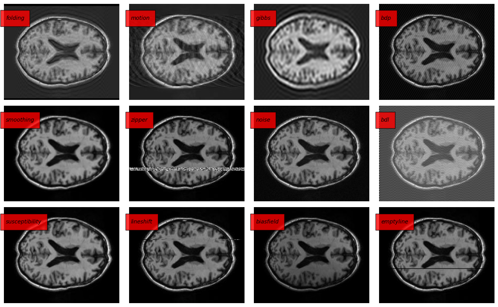

<h1 align="center">
  <br>
  Automatic Quality Control
  <br>
</h1>

<h4 align="center">An Efficient Semi-Supervised Quality Control System Trained Using Phisics-Based MRI-Artefact Generators And Adversarial Training</h4>

<p align="center">
  <a href="https://www.sciencedirect.com/science/article/pii/S1361841523002931">Article</a> •
  <a href="#installation">Installation</a> •
  <a href="#training">Training</a> •
  <a href="#cite">Cite</a> •
  <a href="#authors">Authors</a> •
  <a href="#license">License</a>
</p>



[![CC BY-NC-SA 4.0][cc-by-nc-sa-shield]][cc-by-nc-sa]

## Installation

Download and install `Anaconda` or `miniconda` from the [official website](https://www.anaconda.com/products/distribution). Make it works by opening a shell and running:

```bash
$ conda env list
```

This should prompt the list of your conda environments. Now create a new environment: 

```bash
$ conda create -n qc python=3.9
```

And activate the new env:

```bash
$ conda activate qc
```

Install PyTorch and Torchvision from [PyTorch webpage](https://pytorch.org/get-started/locally/) (use the Anaconda option).

Install the remaining dependencies:

```bash
pip install -r requirements.txt
```

Install the `qcs` (Quality Control System) package locally:

```bash
pip install -e .
```

## Training 

The training phase is divided in 4 phases:

1. Training of the WGAN-GP
2. Training of the Encoder (from f-AnoGAN)
3. Artefact generators parameters optimization 
4. Training the SVM on the generated artefacts

Before going on with the first phase, we have to fix some variables that will be used multiple times.

* `<VOLUMES-FOLDER>`  is where you stored NIfTI files of MRI without artefacts.
* `<IMAGES-FOLDER>` is where you stored 2D images representing the slices extracted from the prev. MRI
* `<OUTPUT-FOLDER>` is where all the intermediate and final outputs will be stored

The remaining parameters are showed in the examples are the ones used for the paper. 

### Step 1 - WGAN-GP

To train the WGAN-GP (Generator and Discriminator models) please run the following command:

 ``` bash
python scripts/train_wgangp.py \
	--image-folder <IMAGES-FOLDER> \
    --output-folder <OUTPUT-FOLDER> \
    --lr 0.001 \
    --batch-size 128 \
    --image-size-for-gan 64 \
    --latent-dim 128 \
    --epochs 3000 \
    --features-critic 64 \
    --features-gen 64 \
    --critic-iter 5 \
    --lambda-gp 10
 ```

This will train a `qcs.fanogan.model.Generator` to generate realistic brain MRI slices and a `qcs.fanogan.model.Discriminator` to lean the real data distribution. The trained model checkpoints will be saved in:

- `<OUTPUT-FOLDER>/models/WGANGP/gen_epoch_3000.ckpt`
- `<OUTPUT-FOLDER>/models/WGANGP/critic_epoch_3000.ckpt`

### Step 2 - Encoder

To train the Encoder using the $\text{IZI}_f$ procedure explained in [f-AnoGAN](https://www.sciencedirect.com/science/article/abs/pii/S1361841518302640), please run:

```bash
python scripts/train_izif_encoder.py \
    --image-folder <IMAGES-FOLDER> \
    --output-folder <OUTPUT-FOLDER> \
    --gen <OUTPUT-FOLDER>/models/WGANGP/gen_epoch_3000.ckpt \
    --critic <OUTPUT-FOLDER>/models/WGANGP/critic_epoch_3000.ckpt \
    --lr 0.0002 \
    --k 1 \
    --batch-size 64 \
    --image-size-for-gan 64 \
    --latent-dim 128 \
    --epochs 500 \
    --features-critic 64 \
    --features-gen 64
```

This will train a `qcs.fanogan.model.Encoder` that maps a real 2D brain MRI slice to the latent space, such that the Generator can reconstruct it with low error. The trained model checkpoints will be saved in:

* `<OUTPUT-FOLDER>/models/IZIF/enc_epoch_500.ckpt`

### Step 3 - Artefact generators parameters

Select one artefact with `#parameters > 0` (find the table of artefacts in the `Tables` section below) and find the optimal parameters by running the following script. In this example, we are optimizing the `motion` parameters:

``` bash
python scripts/find_optimal_parameters.py \
    --image-folder <IMAGES-FOLDER> \
    --output-folder <OUTPUT-FOLDER> \
    --artefact motion \
    --critic <OUTPUT-FOLDER>/models/WGANGP/critic_epoch_3000.ckpt \
    --features-critic 64 \
    --batch-size 64 \
    --image-size-for-gan 64 \
    --procs N # where N is the cores in your CPU, or just write 1 
```

The optimization starts multiple times since many results may be local minimums. All the resulting parameters are stored in the `.pkl` file, while the best parameters are saved as Numpy arrays in the `.npy` file. The result will be saved in:

* `<OUTPUT-FOLDER>/params_optim/motion_best_params.npy`
* `<OUTPUT-FOLDER>/params_optim/motion_runs_results.pkl`

### Step 4 - Feature extraction, selection and SVM training on generated artefacts

This script encompasses the remaining steps of the pipeline as described in the paper. It involves several key stages: preprocessing the volumes, extracting and normalizing slices, and generating the selected artifact. Subsequently, features are extracted from both the regular images and those containing the synthetic artifact. The choice of features depends on the type of artifact being used. An SVM model is then trained on these selected features to distinguish between normal images and images with synthetic artifacts. The dataset of features, the models, and, if the --save-synth-images flag is enabled, the generated images are all stored in the output folder. To execute all these steps, please run the following script. In this example, we have opted for the motion artifact, but you can easily switch to any other artifact listed in the table by replacing the `--artefact` option.


```bash
python scripts/train_svm.py \
    --volume-folder <VOLUMES-FOLDER> \
    --output-folder <OUTPUT-FOLDER> \
    --enc <OUTPUT-FOLDER>/models/IZIF/enc_epoch_500.ckpt \
    --gen <OUTPUT-FOLDER>/models/WGANGP/gen_epoch_3000.ckpt \
    --critic <OUTPUT-FOLDER>/models/WGANGP/critic_epoch_3000.ckpt \
    --features-gen 64 \
    --features-critic 64 \
    --latent-dim 128 \
    --artefact motion \
    --artefact-params <OUTPUT-FOLDER>/params_optim/motion_best_params.npy \
    --save-synth-images \
    --severity 3 \
    --image-size 300 \
    --image-size-for-gan 64 \
    --slices-per-axis 1 \
    --axis -1 \
    --seed 777 \
    --perc-norm 95
```

If you are training the SVM on the `nobrain` artefact, please provide `--nobrain-folder` indicating the path of a folder of 2D images not containing brain slices.  

The output will be saved in:

* `<OUTPUT-FOLDER>/synth-images/motion/*.jpg`
* `<OUTPUT-FOLDER>/datasets/motion_axis_-1_nslices_1_dataset.pkl`
* `<OUTPUT-FOLDER>/models/SVM/motion_svm.pkl`
* `<OUTPUT-FOLDER>/models/SVM/scaler_svm.pkl`
* For some artefacts (e.g. `nobrain`) there is also a PCA saved in the `models` dir.

## Tables

| Name             | Artefact                            |
| ---------------- | ----------------------------------- |
| `nobrain`        | Image doesn't contain a brain       |
| `folding`        | Folding                             |
| `motion`         | Motion / Ghosting                   |
| `gibbs`          | Gibbs artefact                      |
| `bdp`            | Bad data point (in K-space) / Bands |
| `smoothing`      | Smoothing / Blurring                |
| `zipper`         | Zipper                              |
| `noise`          | Noise                               |
| `biasfield`      | Bias field / Bias in intensity      |

## Cite

If this code is useful for your research, please cite:

```
@article{ravi2022efficient,
  title={An efficient semi-supervised quality control system trained using physics-based MRI-artefact generators and adversarial training},
  author={Ravi, Daniele and Barkhof, Frederik and Alexander, Daniel C and Parker, Geoffrey JM and Eshaghi, Arman},
  journal={arXiv preprint arXiv:2206.03359},
  year={2022}
}
```

## Authors

* **Corresponding authors**: Daniele Ravì
* **Co-Authors**: Frederik Barkhof, Daniel Alexander, Lemuel Puglisi, Geoff Parker, Arman Eshaghi
* **Code implementation**: Daniele Ravì, Lemuel Puglisi

## License

This work is licensed under a
[Creative Commons Attribution-NonCommercial-ShareAlike 4.0 International License][cc-by-nc-sa].

[![CC BY-NC-SA 4.0][cc-by-nc-sa-image]][cc-by-nc-sa]

[cc-by-nc-sa]: http://creativecommons.org/licenses/by-nc-sa/4.0/
[cc-by-nc-sa-image]: https://licensebuttons.net/l/by-nc-sa/4.0/88x31.png
[cc-by-nc-sa-shield]: https://img.shields.io/badge/License-CC%20BY--NC--SA%204.0-lightgrey.svg